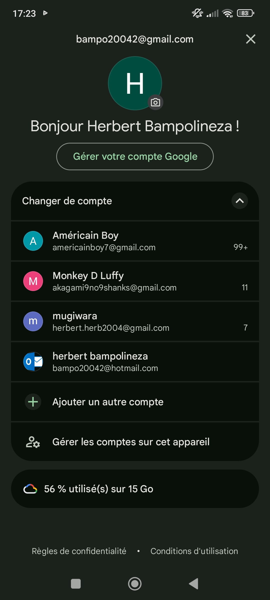
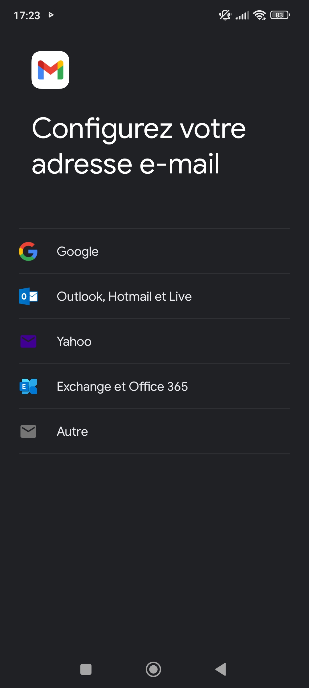
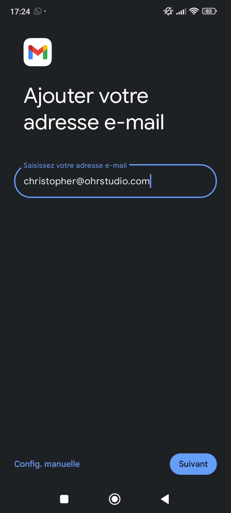
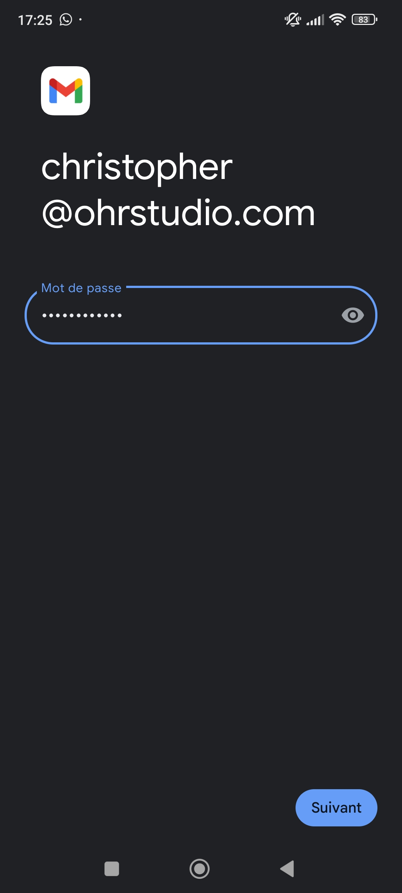
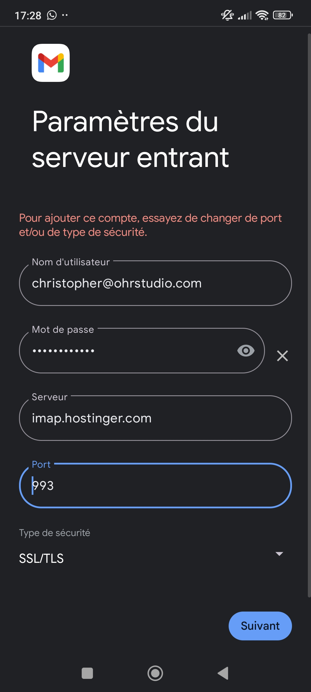
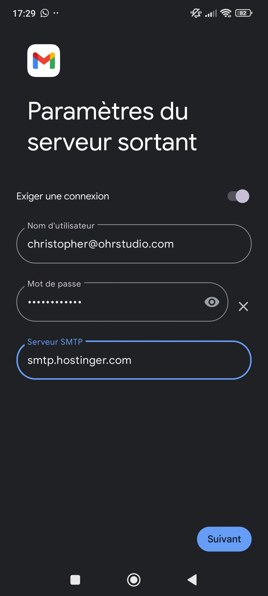

**Guide d’installation de l’adresse email professionnelle et configuration de la signature**

1️⃣ Sur PC
Pour installer l’adresse email professionnelle sur PC et configurer la signature :

Regardez la vidéo suivante : https://drive.google.com/file/d/16arzLxOUSif0ZUCmWXjBO7mHNtVP2qBw/view?usp=sharing

2️⃣ Sur Mobile
Pour installer l’adresse email professionnelle sur votre mobile :

Suivez la procédure suivante :

**1. Ouvrir les paramètres et ajouter un autre compte :** 

**2. Choisisr "Autre" :**

**3. Entrer l'adresse pro :**

**4. Choisir IMAP :**

**5. Rentrer le mot de passe du compte pro :**

**6. Remplir les paramètres suivants :**

**7. Insérer le nom d'expéditeur (en général, prénom + nom de société) :**

***Important : il n’est pas possible de configurer automatiquement la signature sur Gmail Mobile. Vous avez deux options :***

1. Copier-coller la signature manuellement à la fin de chaque mail.

2. Utiliser l’adresse pro sur Gmail Mobile uniquement pour la consultation et rédiger/répondre aux mails depuis le PC.

Si vous devez absolument répondre avec la signature depuis votre mobile, utilisez le WebMail Hostinger : https://mail.hostinger.com
. La signature y est déjà configurée.